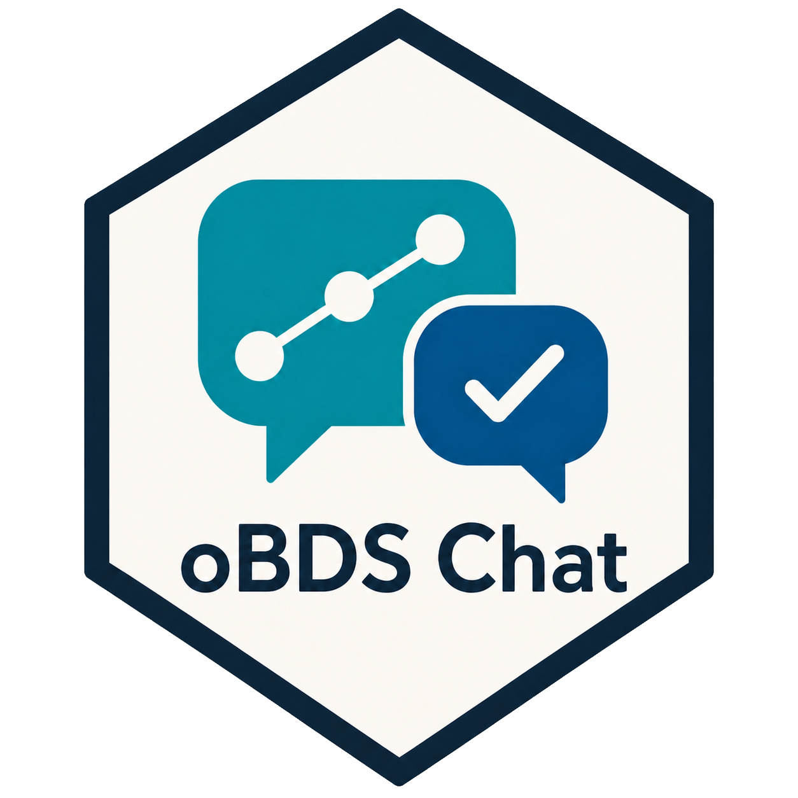
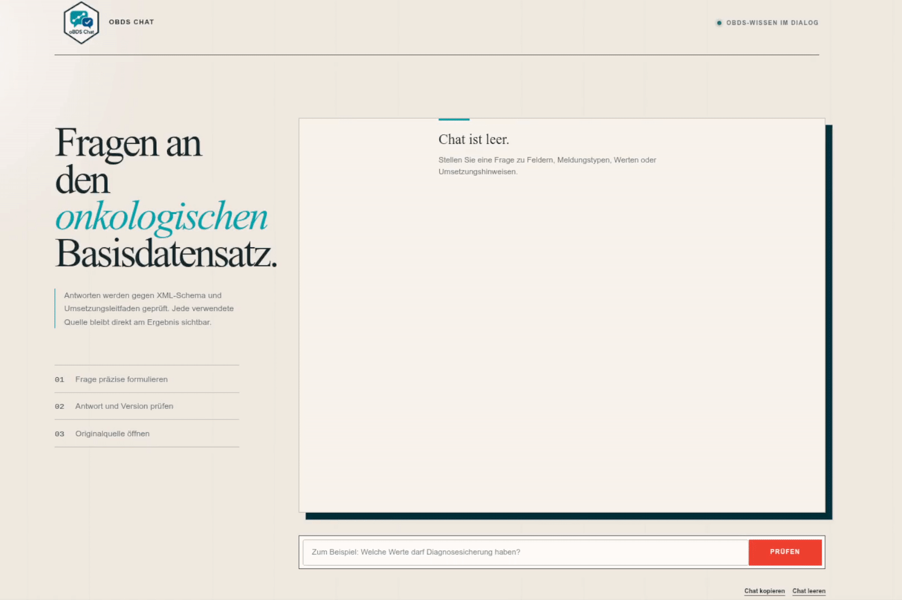

# oBDSChat <a href="https://viktor-pfaffenrot.github.io/oBDSChat/"></a>
<br>

## Overview

oBDSChat is a source-grounded chat application for questions about the German
oncological basic data set (oBDS). It combines two publically available sources:  versioned official oBDS XML schemas and the [Umsetzungsleitfaden](https://plattform65c.atlassian.net/wiki/spaces/UMK/overview). oBDSChat lets a language model retrieve
evidence through controlled local tools, and returns the sources used for each
supported answer.

The browser interface supports contextual follow-up questions, version-aware
schema answers, expandable source cards, and an exact XSD field view with
datatype, cardinality, allowed values, documentation, and original source lines.

Here is a quick demo of the app:



## Installation

The supported installation uses Docker Compose. It requires Git, Docker with
Compose and an OpenAI or Requesty API key.

```bash
git clone https://github.com/viktor-pfaffenrot/oBDSChat.git
cd oBDSChat
cp .env.example .env
mkdir -p config/secrets
chmod 700 config/secrets
```

Create these two gitignored files. The first contains one strong database
password; the second contains the API key for the provider selected in `.env`.

```text
config/secrets/obdschat_db_password.txt
config/secrets/llm_api_key.txt
```

Restrict the files, then build and start the stack:

```bash
chmod 644 config/secrets/obdschat_db_password.txt
chmod 644 config/secrets/llm_api_key.txt
docker compose up -d --build
docker compose ps -a
```

Compose starts ParadeDB, synchronizes the official sources, then starts the
backend, frontend, and documentation site. Open <http://localhost:17860> for
the chat, <http://localhost:8000> for the documentation, or
<http://localhost:18000/docs> for the interactive backend API.

> [!CAUTION]
>The application has no built-in authentication or authorization. Do not expose
>the supplied frontend, backend, or documentation ports to an untrusted network
>without an external access-control boundary.

## Usage

Ask a precise question and include an oBDS version when it matters:

```text
Welche Werte darf Diagnosesicherung in oBDS 3.0.5 haben?
```

oBDSChat searches official schema structure and implementation guidance,
validates the model's citation selection, and displays only evidence used by the
answer. Expand `Beleglage` to inspect sources. For XSD evidence, use
`Feld anzeigen` to inspect the exact schema declaration.

## Model provider

oBDSChat uses the OpenAI-compatible Chat Completions API. `LLM_PROVIDER` selects
`requesty` or `openai`; the mounted `LLM_API_KEY_FILE` takes precedence over a
direct environment key.

### Requesty

The supplied `.env.example` selects Requesty:

```dotenv
LLM_PROVIDER=requesty
LLM_API_KEY_SOURCE=config/secrets/llm_api_key.txt
```

The backend connects to the Requesty EU router and calls the fixed
`policy/obdschat` route. Put the Requesty API key in
`config/secrets/llm_api_key.txt`.

#### Requesty setup

Create a Requesty account and API key, then under `Model Library`, select `Manage` and approve the desired models. The app was tested with gpt-5.6 in all of its variants and with kimi-k2.6. With the models approved, select `Routing Policies` followed by `Create Policy`. Name the policy **`obdschat`** and configure it with the desired models.

For direct OpenAI use, change `.env` and keep the selected provider key in the
same secret file:

```dotenv
LLM_PROVIDER=openai
OPENAI_MODEL=gpt-5.6-terra
```

See the [runtime configuration reference](docs/developer/reference/runtime-configuration.md)
for all provider, database, path, port, and concurrency settings.

## Source synchronization

Source synchronization downloads every official oBDS 3.x schema and replaces
the searchable Umsetzungsleitfaden sections in PostgreSQL. Remote content is
fetched and validated before local writes begin.

### Local development

Install the development environment and start only the Compose database:

```bash
uv sync --group backend --group frontend --group dev
docker compose up -d obdschat-db
```

Run the synchronizer from the repository root with host-reachable database and
secret paths. Database name and user continue to load from `.env`.

```bash
env \
  OBDSCHAT_BASE_DIR="$PWD" \
  OBDSCHAT_DB_HOST=127.0.0.1 \
  OBDSCHAT_DB_PORT=55434 \
  OBDSCHAT_DB_PASSWORD_FILE="$PWD/config/secrets/obdschat_db_password.txt" \
  uv run obdschat-sync-sources
```

Schemas are written below `data/xsd/<version>/`; guide sections are replaced in
the local ParadeDB instance.

### Production

The first `docker compose up` runs the one-shot `source-sync` service before the
backend starts. To refresh an existing deployment, run:

```bash
docker compose run --rm source-sync
```

After synchronization succeeds, restart the backend so its in-memory XSD catalog
is rebuilt from the refreshed volume:

```bash
docker compose restart backend
```

## Evaluation

Evaluation uses the production model, tools, PostgreSQL data, and synchronized
XSD files. Start the Compose stack first, wait for `source-sync` to finish, and
run this command from the repository root:

```bash
env \
  PYTHONPATH=src \
  OBDSCHAT_BASE_DIR="$PWD" \
  OBDSCHAT_DB_HOST=127.0.0.1 \
  OBDSCHAT_DB_PORT=55434 \
  OBDSCHAT_DB_PASSWORD_FILE="$PWD/config/secrets/obdschat_db_password.txt" \
  LLM_API_KEY_FILE="$PWD/config/secrets/llm_api_key.txt" \
  uv run python -m scripts.run_eval
```

The command reads provider, database user, and database name from `.env`, then
writes a timestamped JSON report and PNG summary to `evaluation-results/`. Add
`--no-show` in a headless environment, or use `--limit`, `--case-id`, and
`--category` for focused runs.

## Further documentation

Read the complete documentation at
[oBDSChat Documentation](https://viktor-pfaffenrot.github.io/oBDSChat/).

New users should start with [Ask your first oBDS question](https://viktor-pfaffenrot.github.io/oBDSChat/user/how-to/use-obdschat/).
Developers and operators can continue with:

1. [Local development](https://viktor-pfaffenrot.github.io/oBDSChat/developer/how-to/local-development/)
2. [System architecture](https://viktor-pfaffenrot.github.io/oBDSChat/developer/explanation/system-architecture/)
3. [Runtime configuration](https://viktor-pfaffenrot.github.io/oBDSChat/developer/reference/runtime-configuration/)
4. [Deployment and upgrades](https://viktor-pfaffenrot.github.io/oBDSChat/developer/how-to/deploy/)
5. [Testing changes](https://viktor-pfaffenrot.github.io/oBDSChat/developer/how-to/test-changes/)
6. [ARD](https://viktor-pfaffenrot.github.io/oBDSChat/developer/explanation/ADR/)

Build the complete documentation site with `make docs`, preview it with
`make docs-serve`, or run the strict documentation check with `make docs-check`.

## License

Original oBDSChat code, documentation, configuration, and artwork are licensed
under the [Apache License 2.0](LICENSE). Copyright 2026 Viktor Pfaffenrot.

Third-party software and retrieved source material retain their respective
licenses and copyright. See [THIRD_PARTY_NOTICES.md](THIRD_PARTY_NOTICES.md).
