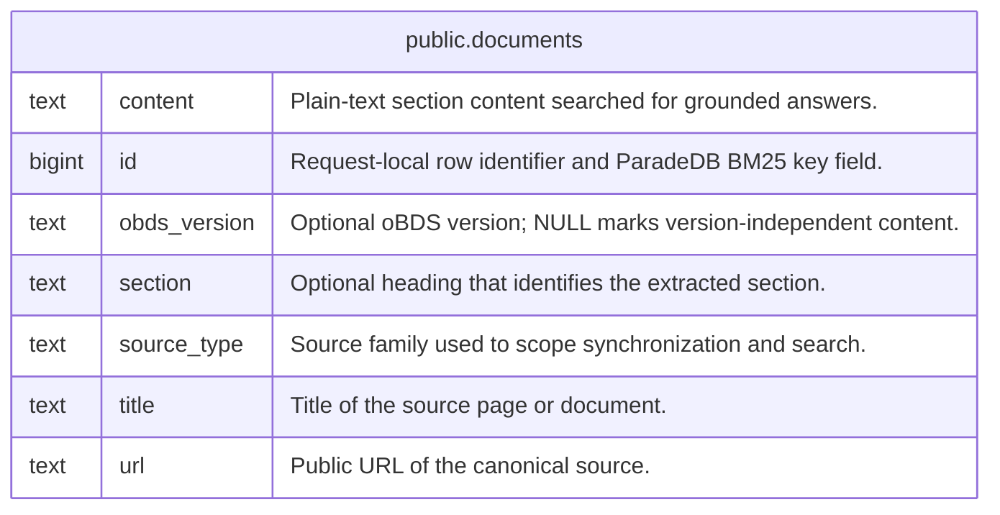

# oBDSChat PostgreSQL schema

## Description

Generated reference for the PostgreSQL data model used by oBDSChat source synchronization and search.  
Tables listed here are application-owned. ParadeDB extension enums may also appear because `pg_search` installs them in the same database.  

## Tables

| Name                                    | Columns | Comment                                                         | Type       |
| --------------------------------------- | ------- | --------------------------------------------------------------- | ---------- |
| [public.documents](public.documents.md) | 7       | Searchable sections extracted from official oBDS documentation. | BASE TABLE |

## Enums

| Name | Values |
| ---- | ------- |
| paradedb.rangerelation | Contains, Intersects, Within |
| paradedb.testtable | Customers, Deliveries, Items, Orders, Parts |

## Relations

---

> Generated by [tbls](https://github.com/k1LoW/tbls)
