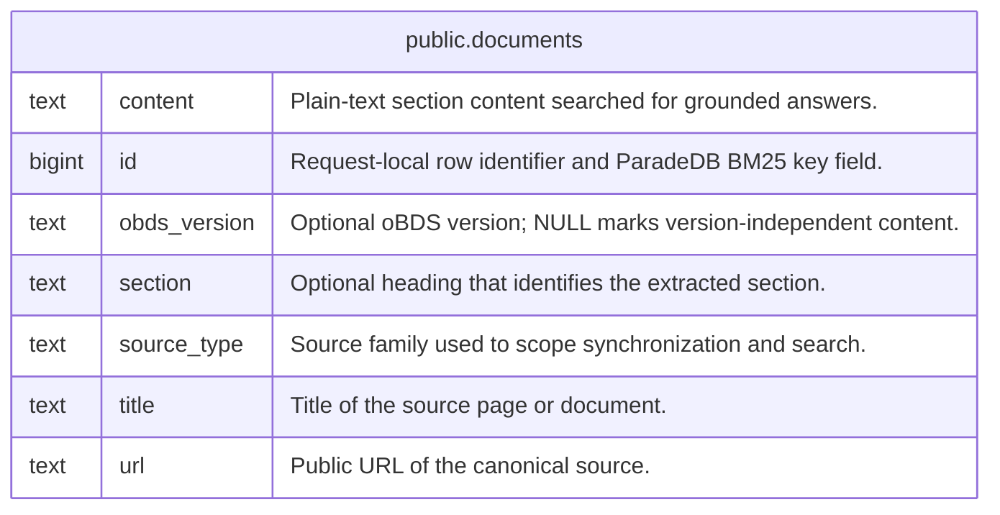

# public.documents

## Description

Searchable sections extracted from official oBDS documentation.

## Columns

| Name         | Type   | Default                               | Nullable | Comment                                                        |
| ------------ | ------ | ------------------------------------- | -------- | -------------------------------------------------------------- |
| content      | text   |                                       | false    | Plain-text section content searched for grounded answers.      |
| id           | bigint | nextval('documents_id_seq'::regclass) | false    | Request-local row identifier and ParadeDB BM25 key field.      |
| obds_version | text   |                                       | true     | Optional oBDS version; NULL marks version-independent content. |
| section      | text   |                                       | true     | Optional heading that identifies the extracted section.        |
| source_type  | text   |                                       | false    | Source family used to scope synchronization and search.        |
| title        | text   |                                       | false    | Title of the source page or document.                          |
| url          | text   |                                       | false    | Public URL of the canonical source.                            |

## Constraints

| Name                           | Type        | Definition           |
| ------------------------------ | ----------- | -------------------- |
| documents_content_not_null     | n           | NOT NULL content     |
| documents_id_not_null          | n           | NOT NULL id          |
| documents_pkey                 | PRIMARY KEY | PRIMARY KEY (id)     |
| documents_source_type_not_null | n           | NOT NULL source_type |
| documents_title_not_null       | n           | NOT NULL title       |
| documents_url_not_null         | n           | NOT NULL url         |

## Indexes

| Name                    | Definition                                                                                                                                                                                                                                                                               | Comment                                                                 |
| ----------------------- | ---------------------------------------------------------------------------------------------------------------------------------------------------------------------------------------------------------------------------------------------------------------------------------------- | ----------------------------------------------------------------------- |
| documents_full_text_idx | CREATE INDEX documents_full_text_idx ON public.documents USING bm25 (id, ((source_type)::pdb.literal), ((title)::pdb.simple('stemmer=german')), ((section)::pdb.simple('stemmer=german')), ((content)::pdb.simple('stemmer=german')), ((obds_version)::pdb.literal)) WITH (key_field=id) | ParadeDB BM25 index for German full-text retrieval and literal filters. |
| documents_pkey          | CREATE UNIQUE INDEX documents_pkey ON public.documents USING btree (id)                                                                                                                                                                                                                  |                                                                         |

## Relations

---

> Generated by [tbls](https://github.com/k1LoW/tbls)
