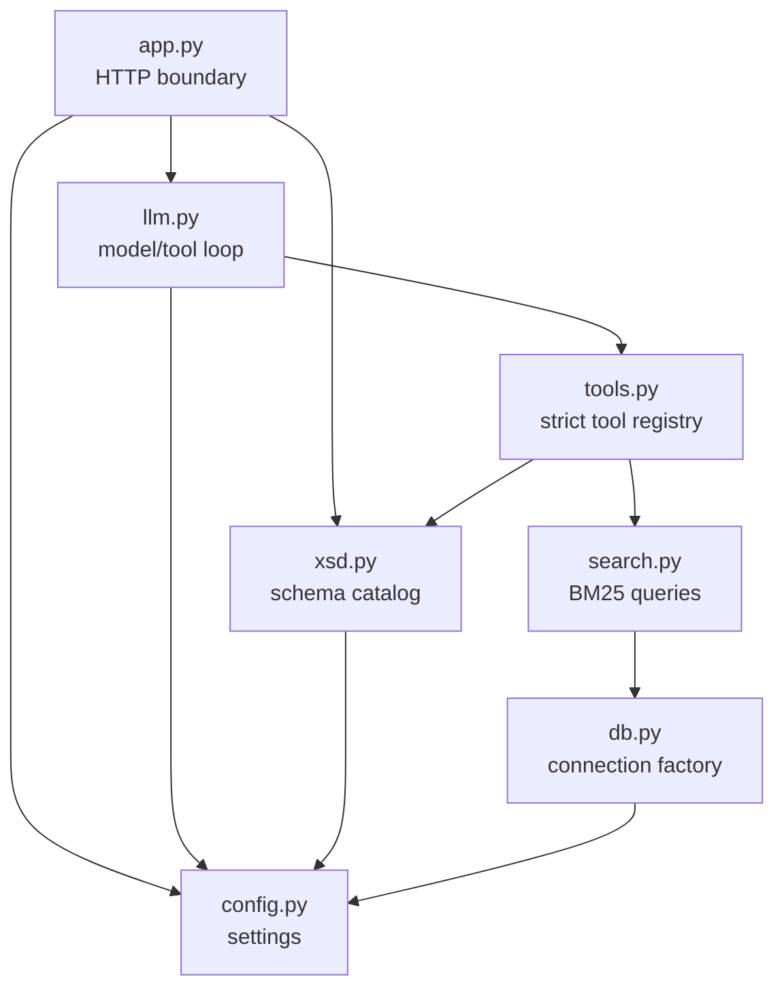

# How the backend works

The backend is a synchronous FastAPI application. It owns public validation,
version resolution, evidence retrieval, model orchestration, citation enforcement,
and response shaping. Route handlers remain thin; specialized modules own each
domain concern.

## Module boundaries

## HTTP boundary

`backend.app` defines Pydantic models beside the FastAPI routes that consume or
return them. Input text is trimmed, whitespace-only input is rejected, extra
fields are forbidden, and conversation count and total character limits are
validated before domain work starts.

The backend exposes liveness, question answering, and exact XSD evidence routes.
Do not maintain a second hand-written signature reference: FastAPI's generated
OpenAPI schema is canonical and renders the
[REST API reference](../reference/rest-api.md).

Expected domain failures are translated at the route boundary:

| Failure category | HTTP meaning |
| --- | --- |
| Requested schema version is unavailable | Unprocessable request |
| Model/provider or model-tool protocol fails | Upstream model failure |
| PostgreSQL, XSD, or required runtime configuration is unavailable | Backend dependency unavailable |
| Exact XSD version or path is absent | Source not found |
| XSD evidence input is malformed | Unprocessable request |

Detailed dependency exceptions are not exposed in generic service-unavailable
responses.

## Configuration resolution

`backend.config.Settings` loads process environment first and `.env` as a local
fallback. It is frozen after validation. Database user and name are required when
building the PostgreSQL URI. Passwords and model keys can come from mounted files;
direct environment secrets remain supported for development compatibility.

The selected provider resolves to one `LlmEndpoint` containing base URL, route,
and key. OpenAI uses `OPENAI_MODEL`; Requesty uses the stable
`policy/obdschat` route so provider-side routing can change independently.

## Versioned XSD catalog

`backend.xsd.SchemaCatalog` discovers directories matching semantic versions and
requires the matching `oBDS_v<version>.xsd` file. The latest sorted version is the
default.

Each version is parsed only on first use. Its in-memory index contains:

- all element occurrences;
- case-insensitive exact-name matches;
- case-insensitive canonical XML-path matches;
- parent and child paths;
- datatype, cardinality, enumeration, and documentation facts;
- source line positions for exact evidence rendering.

The process-wide catalog and per-version indexes are cached. A lock prevents two
threads from building the same version index concurrently. Tests or in-process
source refreshes must clear the catalog cache before expecting new files.

## Prose search

`backend.search` sends fixed parameterized SQL to ParadeDB. Search boosts title
above section above body content, applies German stemming, and can include both
version-specific and version-independent rows. It returns a bounded excerpt for
discovery; a separate exact-ID lookup retrieves complete stored content.

Database connections are short-lived context-managed psycopg connections. There
is no application-level connection pool in the current design.

## Local tool boundary

`backend.tools` adapts XSD and prose functions into `LocalTool` definitions.
Every tool has a strict JSON schema and one Python handler. Optional arguments
are represented as required nullable properties because strict Chat Completions
tools require all declared properties.

Source-bearing results receive deterministic citation IDs:

- XSD evidence: source type, version, and XML path;
- prose evidence: source type and database row ID.

These IDs connect evidence returned to the model with evidence allowed into the
public response.

## Model loop and citation policy

The first model round must call a tool when tools are available. Later rounds may
call more tools or return a structured `ModelAnswer`. Tool names and arguments
are validated; unknown tools, invalid JSON, bad argument types, and excessive
rounds fail the request.

Conversation history is context only. System instructions require the model to
re-establish every answer from tool results produced during the current request.
Final validation enforces two states:

- supported answer: at least one current citation ID;
- unsupported answer: no citation IDs.

`backend.app` then resolves those IDs against actual tool results, rejects unknown
IDs, removes duplicates, and returns only cited source metadata. This prevents
the model from attaching unrelated search hits to a plausible answer.

## Extension seams

The intended extension points are typed and narrow:

- new HTTP behavior: route model and thin route in `backend.app`;
- new evidence capability: domain function plus `LocalTool` adapter;
- new provider: configuration enum and endpoint resolution;
- new prose retrieval behavior: typed result and parameterized query in
  `backend.search`;
- new schema fact: `SchemaElement`/related model plus catalog extraction.

Use [Extend the backend](../how-to/extend-backend.md) for change procedures.
