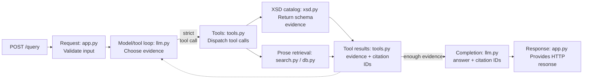

# How the backend works

The backend is a FastAPI application that turns an oBDS question into a
source-grounded answer. It validates the public request, resolves the relevant
oBDS version, lets an OpenAI-compatible model request well-defined local
evidence tools, verifies the model's citations, and returns a typed response.

The language model never receives database credentials, arbitrary SQL access,
filesystem access, or a general HTTP client. All evidence access crosses the
tool boundary described in [LLM tools](#llm-tools).

## Runtime data flow

Arrows show runtime data flow for one `POST /query` request. The dashed arrow
shows the model requesting more evidence before producing an answer.



| Module | Owns |
| --- | --- |
| `backend.app` | HTTP models, input limits, route orchestration, error mapping, citation-to-source conversion |
| `backend.config` | Environment loading, secret resolution, provider endpoint selection, database URI construction |
| `backend.llm` | Chat Completions messages, tool-call loop, version enforcement, structured answer and citation policy |
| `backend.tools` | Model-visible tool definitions, strict schemas, adapters, citation-ID injection |
| `backend.xsd` | Version discovery, lazy XSD indexes, structural queries, exact source evidence |
| `backend.search` | Parameterized ParadeDB queries and typed prose results |
| `backend.db` | Short-lived PostgreSQL connection construction |

This separation keeps route handlers thin and makes the model-facing surface
small enough to audit and test.

## Request boundary

`POST /query` accepts a question, an optional exact `obds_version`, and up to
ten completed conversation turns. Pydantic trims input, rejects whitespace-only
values and unknown fields, and enforces both per-field limits and a 50,000
character total history limit.

Conversation history resolves references such as "und da?" or a version selected
in an earlier question. It is not evidence: every answer must be re-established
from tools executed for the current request.

The route performs this orchestration:

1. Build a version (`VersionContext`) from synchronized XSD versions.
2. Convert public history datamodels to internal `ConversationTurn` values.
3. Call `answer_question` with the complete local tool registry.
4. Verify that every citation selected by the model was returned by a tool during this request, then convert cited results into public source metadata.
5. Return the answer, versions used by successful retrieval, and deduplicated
   public source metadata.

FastAPI's generated OpenAPI schema is the [REST API reference](../reference/rest-api.md).

### Failure mapping

Expected failures become stable HTTP responses at the route boundary:

| Failure | Response |
| --- | --- |
| Explicit request version is not synchronized | `422 oBDS schema version '<version>' is unavailable. Available versions: ...` |
| Model provider, structured-answer, tool-call, or citation protocol fails | `502 Language model request failed` |
| PostgreSQL, XSD parsing, secrets, or required runtime configuration fails | `503 Schema source unavailable` |
| Exact XSD evidence version or path is absent | `404 Not Found` |
| Exact XSD evidence input is malformed | `422 Unprocessable Content` |

The Dependency responses do not expose provider messages, database details,
secret paths, or parser internals.

## Provider configuration

On each load, `Settings` reads process environment variables and fills missing values from `.env`. In deployment, Docker Compose loads `.env` into the container environment before starting the backend. Pydantic validates and normalizes the environment variables, then creates an immutable settings instance. `resolve_llm_endpoint()` selects the configured provider’s URL, model or policy route and API key and packages them in a common `LlmEndpoint` used by the model. Currently, two provider options are implemented:

| Provider | Base URL | Route selection | Key source |
| --- | --- | --- | --- |
| OpenAI | `https://api.openai.com/v1` | `OPENAI_MODEL`, default `gpt-5.6-terra` | `OPENAI_API_KEY` or mounted key file |
| Requesty | `https://router.eu.requesty.ai/v1` | Stable `policy/obdschat` policy route | `REQUESTY_API_KEY` or mounted key file |

`LLM_API_KEY_FILE` takes precedence over a direct provider key. The provider
branch stays in configuration; the orchestration layer uses the same
OpenAI-compatible Chat Completions protocol for both providers.

When LLM_API_KEY_FILE is configured, The backend reads the API key from the secrets file `LLM_API_KEY_FILE`. Provider-specific URL, route, and key selection remains in `config.py`. llm.py uses the same OpenAI-compatible Chat Completions client all providers.

## LLM tools

LLM tools are the only path from model reasoning to local oBDS evidence. This
section describes them in more detail.

### Tool boundary and registry

There are in total seven `LocalTool` definitions.
Each definition binds a unique model-visible name and description to a strict
JSON object schema and one synchronous Python handler.

| Tool | Use it for | Result | Result limit |
| --- | --- | --- | --- |
| `search_schema` | Discover XSD elements when exact name or path is unknown | `SchemaElement[]` | 10 by default; caller may override |
| `get_schema_concept_locations` | Exhaustively find every structural location and containing message type for a concept | `SchemaConceptLocation[]` | None; deliberately exhaustive |
| `get_schema_element` | Retrieve complete facts for an exact name or XML path | `SchemaElement[]` | All exact matches |
| `get_schema_values` | Retrieve allowed enumeration values for an exact name or path | `SchemaValues[]` | All exact matches |
| `get_schema_cardinality` | Retrieve `minOccurs` and `maxOccurs` for an exact name or path | `SchemaCardinality[]` | All exact matches |
| `search_umsetzungsleitfaden` | Discover official prose about meaning, rules, guidance, or edge cases | `SearchResult[]` | 5 by default; caller may override |
| `get_source_excerpt` | Fetch complete stored prose after discovery by source ID | `SourceExcerpt` or `null` | One exact row |

Schema tools are used for XML structure and prose tools (`search_umsetzungsleitfaden` and `get_source_excerpt`) for explanatory guidance. A strong answer may use both when the question combines e.g. values with interpretation.

### Strict tool contracts

Every tool schema has these properties:

- top-level type is `object`;
- every declared property appears in `required`;
- `additionalProperties` is `false`;
- semantically optional inputs use a nullable type and must still be present;
- Chat Completions receives `strict: true` for every function definition.

For example, a schema-conforming call cannot omit `version`; the model sends
`"version": null` to request default resolution. `LocalTool` validates the shape
of each registered schema when the registry is built. During execution, the
backend additionally requires decoded arguments to be a JSON object, validates
version semantics, and converts handler `TypeError` or `ValueError` failures to
a tool-protocol failure. Domain handlers remain responsible for constraints
that cannot be expressed by the shared schema helpers.

For example, `"version": null` requests default version. When tools are registered, `LocalTool` checks common strict-schema rules. For each model call, backend parses the JSON object, applies version rules, and invokes the handler. Invalid arguments abort the tool protocol. Individual handlers validate domain rules, such as requiring either an element name or path. With this, the model never sees or executes the handler directly.

Common arguments:

| Argument | Type | Meaning |
| --- | --- | --- |
| `version` | string or `null` | Exact synchronized semantic version. `null` is resolved by `VersionContext`. |
| `limit` | integer or `null` | Positive maximum result count. `null` selects the tool default. No schema-level maximum is imposed. |
| `name` | string or `null` | Case-insensitive exact XML element name. May match multiple paths. |
| `path` | string or `null` | Case-insensitive exact canonical XML path. Selects at most one occurrence before any name filter. |

For the three exact selector tools (`get_schema_element`, `get_schema_values`, `get_schema_cardinality`), `name`, `path`, and `version` are all
required nullable properties. At least one of `name` or `path` must be
non-null. When both are supplied, the element selected by `path` must also
match `name`.

### Version handling

Version-aware tools do not decide their effective version independently. Before
calling a handler, `backend.llm` applies request-level `VersionContext`:

| Situation | Effective behavior |
| --- | --- |
| Request contains `obds_version` | That validated version overrides every model-supplied version. |
| No request constraint and tool sends a version | Use that exact version. |
| No request constraint and tool sends `null` | Use newest XSD version. |
| Question compares versions | Model calls version-aware tools separately for each relevant version. |
| Model requests an unavailable version | Do not call handler; return structured `unsupported_obds_version` result to model with requested and available versions. |

If the model is asked with an unavailable oBDS version, the backend does not execute the retrieval handler. Instead, it returns a structured error to the model. The model may then correct its tool call or explain that version is unavailable.

The prose tool `get_source_excerpt` has no version argument because it follows an exact source ID returned by prose discovery. `search_umsetzungsleitfaden` receives the
effective version and includes both rows for that version and version-independent rows.

### Versioned XSD catalog

`SchemaCatalog` manages local XSD files for all available oBDS versions. It discovers versions at startup and uses newest version by default. When a version is queried for first time, the backend parses its XSD and builds an in-memory lookup index; later requests reuse that index. The index contains element structure, datatypes, occurrence rules, allowed values, documentation, source metadata, and source-line positions. A lock prevents concurrent requests from building the same index twice. Because cached indexes do not track file changes, the backend must clear cache or restart after replacing XSD files.

#### `search_schema`

**Arguments:** `query` (string), `version` (string or `null`), `limit`
(positive integer or `null`, default 10).

This discovery tool is used when the exact XML name or path is unknown. It searches
normalized element names, paths, datatypes, documentation, and enumeration
text. Exact-name matches rank highest; remaining matches are scored
deterministically and ties are ordered by path. Results are bounded by `limit`.

This tool is ment as a quick look-up. For coverage questions `get_schema_concept_locations` should be used.

```json
{
  "query": "Diagnosesicherung",
  "version": "3.0.5",
  "limit": null
}
```

#### `get_schema_concept_locations`

**Arguments:** `concept` (string), `version` (string or `null`).

`get_schema_concept_locations` is used when every place where a concept occurs in one XSD version is needed. It scans all indexed elements without a result limit, prefers matches in element or datatype names, and falls back to documentation or enumeration text only when no structural matches exist. Each result identifies its XML path, containing message type, and fields that matched.

```json
{
  "concept": "TNM",
  "version": "3.0.5"
}
```

#### `get_schema_element`

**Arguments:** `name`, `path`, and `version` (each string or `null`); at
least one selector must be non-null.

This tool is used after discovery, or immediately when an exact name or canonical path is
known. It returns complete `SchemaElement` facts. Name lookup may return many
occurrences because the same XML name can appear under different paths. Path
lookup selects at most one occurrence.

#### `get_schema_values`

**Arguments:** same selector contract as `get_schema_element`.

`get_schema_values` returns the XSD enumeration values for elements selected by exact name or path. Each result represents one matching element and contains its allowed values and their optional descriptions. An empty `values` array means the element exists but defines no enumeration. An empty outer result array means that no element matched the selector.

#### `get_schema_cardinality`

**Arguments:** same selector contract as `get_schema_element`.

This is used for occurrence rules of an exact element. Each result contains `name`,
`path`, `min_occurs`, `max_occurs`, version and source metadata.
`max_occurs` is an integer or the string `unbounded`.

### Umsetzungsleitfaden retrieval

Official guide content is stored as heading-sized rows in PostgreSQL. ParadeDB
indexes title, section, and content fields. Retrieval uses fixed,
parameterized SQL; model arguments cannot change selected columns, filters,
ordering, or SQL structure. Database connections are short-lived and
context-managed.

#### `search_umsetzungsleitfaden`

**Arguments:** `query` (German string), `version` (string or `null`),
`limit` (positive integer or `null`, default 5).

This discovery tool is used for field meaning, implementation guidance, rules, and
edge cases. BM25 ranking boosts title threefold and section twofold relative to
body content, then orders equal scores by database ID. With an effective
version, the query includes both matching version-specific rows and rows whose
version is null.

Each result contains `source_id`, `source_type`, `title`, optional
`section`, a maximum 600-character `excerpt`, `url`, optional
`obds_version`, and `score`.

```json
{
  "query": "Diagnosesicherung unbekannt",
  "version": "3.0.5",
  "limit": null
}
```

#### `get_source_excerpt`

**Arguments:** `source_id` (integer, minimum 1).

This tool returns complete stored content for the exact row, not another bounded excerpt. The result contains `source_id`, `source_type`, `title`, optional `section`, `content`, `url`, and optional `obds_version`. A missing ID returns `null`.

The model should obtain IDs from `search_umsetzungsleitfaden`; IDs identify
rows in the currently synchronized corpus.

### Tool result citations

Adapters add a deterministic `citation_id` whenever result metadata identifies
a source:

| Source | Citation ID |
| --- | --- |
| XSD result | `xsd:<version>:<canonical-path>` |
| Prose result | `umsetzungsleitfaden:<source-id>` |

Citation IDs are internal evidence handles, not user-facing citation text. They
connect three stages: evidence returned to the model, IDs selected in the
structured model answer, and sources allowed into the public response.

### Tool failure behavior

| Condition | Behavior |
| --- | --- |
| Unknown tool or unsupported tool-call type | Abort loop with `ToolCallError` |
| Invalid JSON or non-object arguments | Abort loop with `ToolCallError` |
| Empty or wrongly typed version | Abort loop with `ToolCallError` |
| Unavailable model-selected version | Return structured error to model; continue loop |
| Handler raises `TypeError` or `ValueError` | Treat as invalid arguments; abort loop |
| Handler result is not JSON-serializable | Abort loop with `ToolCallError` |
| Database, schema, configuration, or provider fails | Propagate to route for sanitized HTTP mapping |
| Model returns no choice, no structured answer, empty answer, or invalid citation state | Abort loop with `ToolCallError` |
| Model cites an ID absent from current executions | Reject response at HTTP boundary |

### Adding or changing a tool

See [How to extend the backend](../how-to/extend-backend.md).

### Concurrency and lifecycle

`POST /query` is asynchronous. Provider I/O is awaited, while schema version
resolution and synchronous tool handlers use worker threads. Different requests
can therefore overlap. Work within one request remains ordered, and the backend
returns one complete answer rather than streaming partial output.
