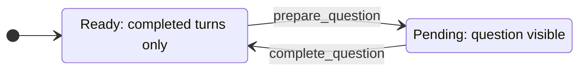

# How the frontend works

The frontend runs as a separate FastAPI web application. Gradio provides the chat interface, while FastAPI serves supporting routes such as health checks, static assets, and the XSD evidence viewer. The frontend manages presentation and conversation history for each browser session. It communicates with the backend only through validated HTTP requests and never accesses backend code or PostgreSQL directly.

## Component split

`frontend.api` defines the frontend’s HTTP client and data models for communicating with the backend. Public response models live in the dependency-light `obdschat_api.models`
module shared with the backend. Before sending a request, it validates the backend URL and request data. It uses fixed timeouts so requests cannot wait forever. Network and HTTP errors are converted into a common `BackendApiError`. Successful responses are parsed and checked against the expected response model before the frontend uses them.
 e12a7b1 (updated docs)

`frontend.app` contains:

- **immutable conversation state models**: Store questions, answers, citations, and pending requests
- **Gradio event handlers**: Functions that run when user submits, clears, copies, or clicks something.
- **bounded query-event concurrency configuration**: Limits how many backend questions one frontend process handles simultaneously.
- **chat and source-card rendering**: Converts answers and citations into visible chat messages and source cards.
- **clipboard formatting**: Converts conversation into clean plain text for copying.
- an HTML XSD evidence viewer
- **frontend liveness route and Gradio mounting**

`frontend.assets/styles.css` styles both the Gradio surface and exact-field view.

## Conversation state

`prepare_question` validates and stores a pending question, clears the input, and
renders a visible progress state without waiting for HTTP. A chained Gradio event
runs `complete_question`, which performs one backend request and replaces the
pending state with either a completed turn or an error card.

Clicking the submit button or pressing Enter starts a backend request in the
shared `backend-queries` concurrency group. `OBDSCHAT_QUERY_CONCURRENCY` limits
how many of these requests one frontend process can handle at once and defaults
to eight. This lets requests from different browser sessions run at the same
time. Calls made directly to the backend API do not use this limit.

Completed turns keep their answers and source metadata. Before each backend
request, the frontend sends the newest completed turns that fit the backend's
limits on turn count and total characters. Pending and failed turns are never
included in this history.

## Rendering and escaping

Gradio removes unsafe HTML from chat messages before displaying them. The frontend also escapes source-card values before adding them to HTML. External links use `noopener noreferrer` for security. Copied conversations use a separate plain-text version, so interactive HTML is not copied.

For an XSD citation, the source card links to a frontend-owned exact-field route.
Client-side code opens that route in a same-origin iframe. The route fetches typed
evidence from the backend, escapes content, and renders highlighted source lines.
Cross-window close messages are accepted only from the same origin and active
iframe.

## Shared HTTP response contracts

Backend and frontend import public response models from `obdschat_api.models`.
The neutral package depends only on Pydantic and standard-library typing, so the
frontend never imports backend application or infrastructure modules and the
container dependency groups remain separate. Backend code converts domain
objects into these DTOs; frontend code still owns transport and rendering.

Changing a response contract requires one model edit and rebuilding both service
images. Frontend rendering changes only when it consumes an added, removed, or
renamed field. Strict validation still requires compatible rollout steps if old
and new images can run together.

## Current trade-offs

The client creates a new `httpx.Client` for each operation. This avoids shared
client lifecycle concerns but does not reuse connections. Conversation state is
session-local and has no durable store. Answers are not streamed.
Query concurrency is bounded per frontend process rather than across a
multi-instance deployment. These constraints keep the frontend small.
