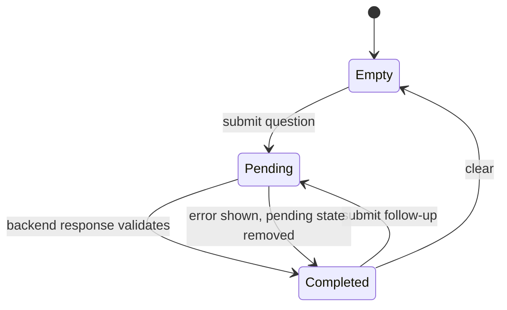

# How the frontend works

The frontend is a Gradio application mounted into a small FastAPI host. It owns
presentation and browser-session conversation state. It never imports backend
domain functions or opens PostgreSQL; all application data crosses a typed HTTP
boundary.

## Component split

`frontend.api` contains a synchronous `BackendClient` and request payload model.
Public response models live in the dependency-light `obdschat_api.models`
module shared with the backend. The client validates `BACKEND_URL`, applies
bounded HTTP timeouts, translates transport/status failures into
`BackendApiError`, and strictly validates every successful JSON response.

`frontend.app` contains:

- immutable conversation state models;
- Gradio event handlers;
- bounded query-event concurrency configuration;
- chat and source-card rendering;
- clipboard formatting;
- an HTML XSD evidence viewer;
- frontend liveness route and Gradio mounting.

`frontend.assets/styles.css` styles both the Gradio surface and exact-field view.

## Conversation state

`prepare_question` validates and stores a pending question, clears the input, and
renders a visible progress state without waiting for HTTP. A chained Gradio event
runs `complete_question`, which performs one backend request and replaces the
pending state with either a completed turn or an error card.

The button-click and Enter-key completion events share the `backend-queries`
concurrency group. `OBDSCHAT_QUERY_CONCURRENCY` sets its positive per-process
limit and defaults to eight. This permits requests from different frontend
sessions to overlap while bounding work initiated by one frontend process. It
does not limit clients that call the backend API directly.

Completed turns retain the answer and source metadata. Before each request, the
frontend selects the newest complete turns within backend count and character
limits. Pending or failed turns are never sent as history.

## Rendering and escaping

Gradio sanitizes chat HTML. Custom source-card values are also escaped before
HTML interpolation. External links use `noopener noreferrer`. Copied transcripts
are produced separately as plain text, so interactive markup never leaks into the
clipboard representation.

For an XSD citation, the source card links to a frontend-owned exact-field route.
Client-side code opens that route in a same-origin iframe. The route fetches typed
evidence from the backend, escapes content, and renders highlighted source lines.
Cross-window close messages are accepted only from the same origin and active
iframe.

## Shared HTTP response contracts

Backend and frontend import public response models from `obdschat_api.models`.
The neutral package depends only on Pydantic and standard-library typing, so the
frontend never imports backend application or infrastructure modules and the
container dependency groups remain separate. Backend code converts domain
objects into these DTOs; frontend code still owns transport and rendering.

Changing a response contract requires one model edit and rebuilding both service
images. Frontend rendering changes only when it consumes an added, removed, or
renamed field. Strict validation still requires compatible rollout steps if old
and new images can run together.

## Current trade-offs

The client creates a new `httpx.Client` for each operation. This avoids shared
client lifecycle concerns but does not reuse connections. Conversation state is
session-local and has no durable store. Answers are atomic rather than streamed.
Query concurrency is bounded per frontend process rather than across a
multi-instance deployment. These constraints keep the frontend small, but they
are explicit design points to revisit for higher request volume, saved
conversations, or streaming output.
