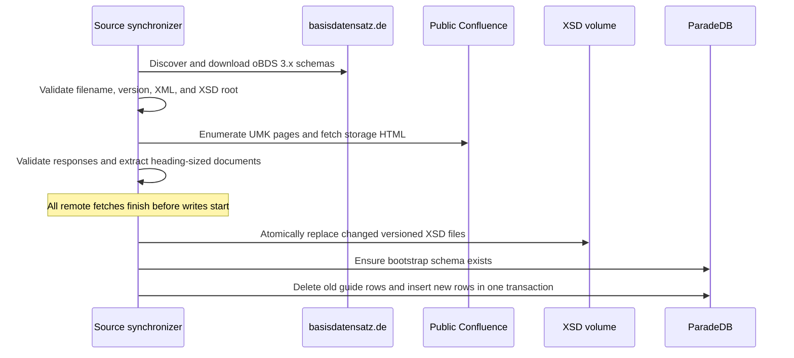
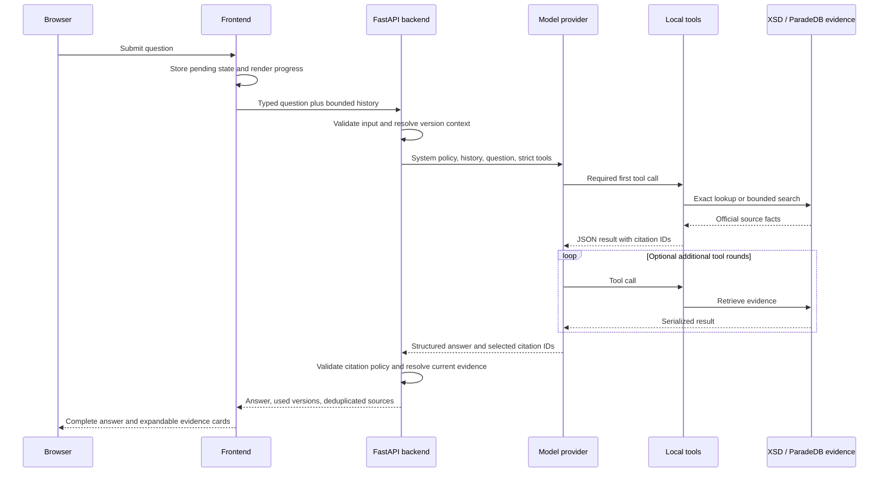
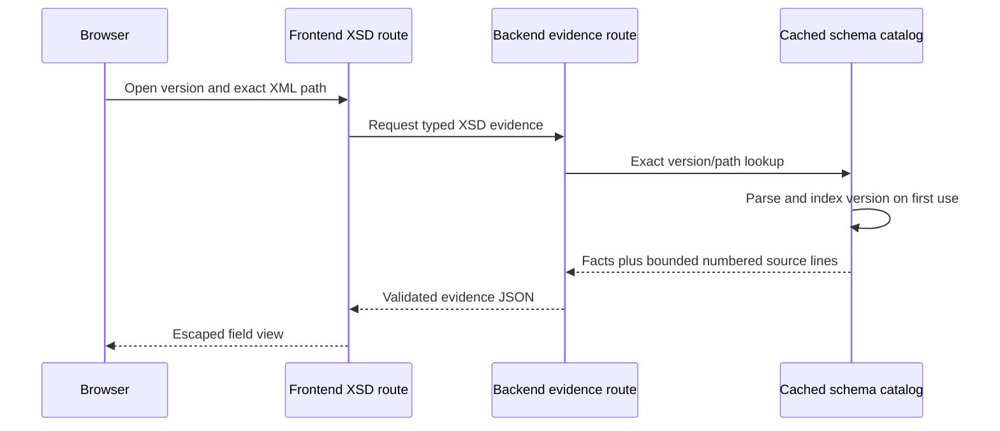

# How requests and data move through oBDSChat

Three flows explain most changes: source synchronization, question answering, and
exact XSD evidence viewing.

## Source synchronization

Outbound URLs and redirects are restricted to the expected official hosts. The
synchronizer rejects empty corpora and malformed source metadata. PostgreSQL
replacement affects only rows whose source type is `umsetzungsleitfaden`.

## Question answering

If the API explicitly constrains `obds_version`, every version-aware tool call is
forced to that version. Otherwise, model tool arguments can select a version;
missing selection resolves to the newest available XSD version.

The backend returns only sources named by the model and verified against current
tool executions. Search results that were read but not cited do not appear in the
response.

## Exact XSD evidence view

The evidence excerpt includes three context lines around the declaration and is
bounded to 160 lines. Metadata reports the full declaration range and whether the
displayed declaration was truncated.

## Failure propagation

- Frontend transport failures become a user-safe backend-unreachable message.
- Backend validation failures retain HTTP client-error meaning.
- Model failures become a bad-gateway response.
- database, runtime configuration, and XSD parsing failures become
  service-unavailable responses.
- Frontend response-model mismatch becomes an invalid-backend-response message.

Health routes are intentionally outside these dependency flows; they report only
whether their own process can answer HTTP.
