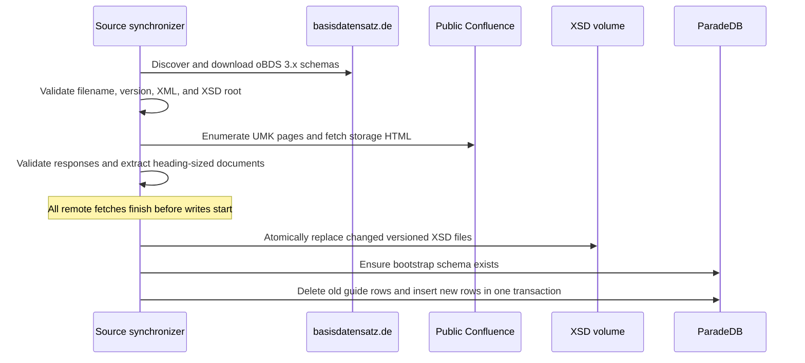
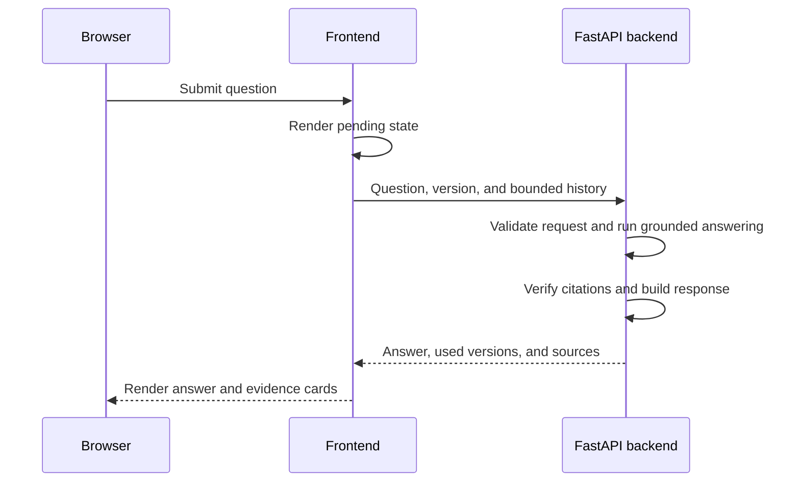
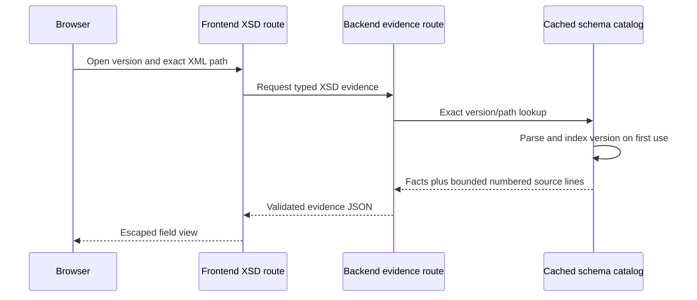

# How requests and data move through oBDSChat

Three flows explain most changes: source synchronization, question answering, and
exact XSD evidence viewing.

## Source synchronization

Outbound URLs and redirects are restricted to the expected official hosts. The
synchronizer rejects empty corpora and malformed source metadata. PostgreSQL
replacement affects only rows whose source type is `umsetzungsleitfaden`.

## Question answering

The backend's model, tool, and evidence processing is described in
[How the backend works](backend-architecture.md#runtime-data-flow).

## Exact XSD evidence view

The evidence view shows the declaration with up to three lines of surrounding
context. To keep the response manageable, the excerpt is limited to 160 lines.
The metadata still records the declaration's complete line range and indicates
whether the excerpt omits any part of it.
