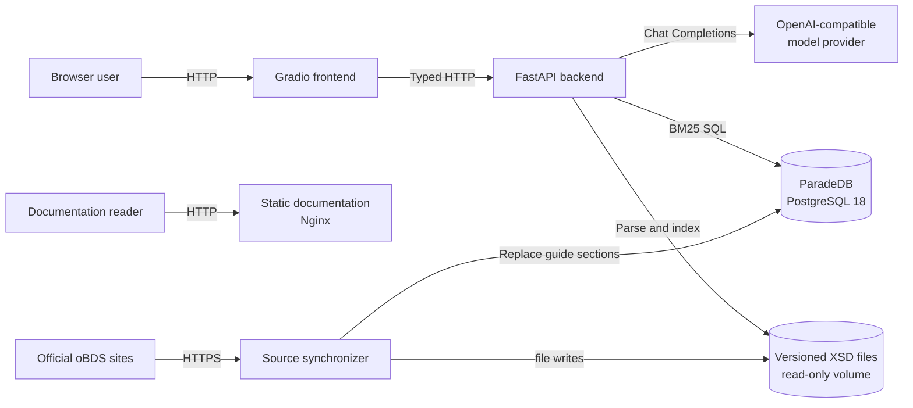
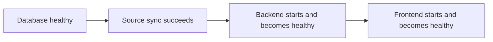
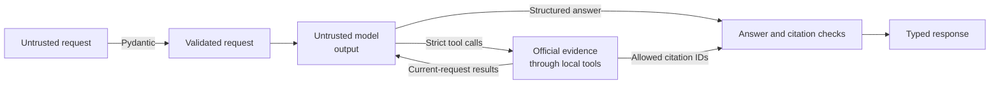

# How oBDSChat is structured

oBDSChat separates presentation, orchestration, evidence retrieval, and source
storage. The split keeps the language model away from direct HTTP and database
access: it can request only the local tools registered by the backend.

## Runtime components

The Compose deployment contains five services:

| Service | Responsibility | Persistent input/output |
| --- | --- | --- |
| `obdschat-db` | PostgreSQL plus ParadeDB BM25 search | Bind-mounted PostgreSQL data and logs |
| `source-sync` | Download and validate official sources before application startup | Writes the XSD files and rows within postgres' `documents` table |
| `backend` | Validate requests, retrieve evidence, orchestrate the model, validate citations | Reads PostgreSQL and XSD files |
| `frontend` | Render chat and XSD evidence views | Browser-session conversation state only |
| `docs` | Serve the statically built MkDocs site | None |

Use [How to deploy and upgrade oBDSChat](../how-to/deploy.md) for the supported
single-host Compose procedure and
[How to diagnose an oBDSChat deployment](../how-to/troubleshoot-operations.md)
for failures of the already deployed app.

## Startup dependency chain

This ordering makes missing or invalid source data a startup failure instead of
allowing the application to answer from a partially updated corpus. The database
health check tests PostgreSQL readiness. Backend and frontend health checks test
process liveness and intentionally do not call downstream dependencies. The
documentation service starts independently because it serves only static files.

## Evidence Mechanisms

Two evidence mechanisms serve different source shapes:

- PostgreSQL stores heading-sized Umsetzungsleitfaden sections. ParadeDB ranks
  German prose matches with the BM25 algorithm and field boosts.
- Versioned XSD files stay as files. The backend builds an in-memory, exact-path
  schema index lazily because XML structure, relationships, and source line
  locations do not map naturally to the prose search table.

The model sees only results from registered tools. It does not receive
database credentials, arbitrary SQL capability, filesystem access, or a generic
HTTP client.

## Trust and validation boundaries

This diagram shows which data the application may trust and which checks
establish that trust.

Trust is established at four checks:

- **Request validation:** Pydantic converts untrusted HTTP input into a validated
  `QueryRequest`, rejecting unknown fields, invalid types, blank text, and
  oversized history.
- **Tool access:** Model output remains untrusted. Only strict registered tool
  calls may reach official XSD or prose evidence; the model has no direct
  database, filesystem, or HTTP access.
- **Evidence provenance:** Tool results are recorded for the current request and
  returned to the model as data. Their citation IDs (internal identifiers for
  specific evidence results) define the sources eligible for the public response.
- **Answer validation:** Model output must match `ModelAnswer`. Supported answers
  must cite current-request evidence; unsupported answers must cite none. The
  backend rejects unknown IDs and returns cited, deduplicated sources in a typed
  `QueryResponse`.

## Design trade-offs

Within one query, model rounds and tool executions remain ordered and the answer
is returned atomically. There is no partial streaming, so frontend HTTP timeouts
remain deliberately long. Raising frontend concurrency may increase provider,
database, and worker-thread load.

Source synchronization fetches and validates all schemas, pages, and extracted documents before writing anything locally. If fetching or validation fails, existing local data remains unchanged. XSD files are replaced one file at a time, while Umsetzungsleitfaden rows are replaced in one database transaction. Treat successful completion of source synchronization as the point when both stores are known to be consistent.

For simplicity, there is currently no authentication or authorization inside the application. Any network exposure must therefore be controlled outside the application until an auth boundary is added.

For a full list of design decisions see the [ARD](../explanation/ADR.md).
