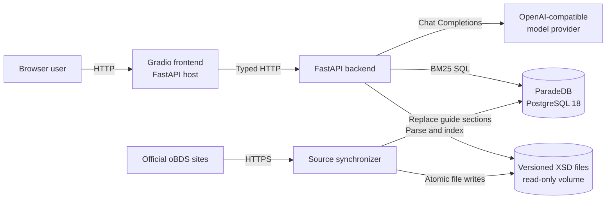
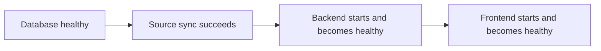
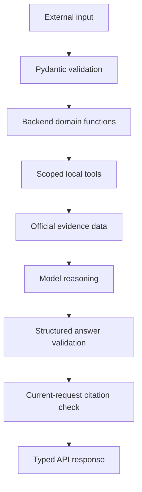

# How oBDSChat is structured

oBDSChat separates presentation, orchestration, evidence retrieval, and source
storage. The split keeps the language model away from direct HTTP and database
access: it can request only the local tools registered by the backend.

## Runtime components

The Compose deployment contains four services:

| Service | Responsibility | Persistent input/output |
| --- | --- | --- |
| `obdschat-db` | PostgreSQL plus ParadeDB BM25 search | Bind-mounted PostgreSQL data and logs |
| `source-sync` | Download and validate official sources before application startup | Writes the XSD volume and `documents` rows |
| `backend` | Validate requests, retrieve evidence, orchestrate the model, validate citations | Reads PostgreSQL and XSD volume |
| `frontend` | Render chat and XSD evidence views | Browser-session conversation state only |

Use [How to deploy and upgrade oBDSChat](../how-to/deploy.md) for the supported
single-host Compose procedure and
[How to diagnose an oBDSChat deployment](../how-to/troubleshoot-operations.md)
for service-level failures.

## Startup dependency chain

This ordering makes missing or invalid source data a startup failure instead of
allowing the application to answer from a partially updated corpus. The database
health check tests PostgreSQL readiness. Backend and frontend health checks test
process liveness and intentionally do not call downstream dependencies.

## Evidence boundary

Two evidence mechanisms serve different source shapes:

- PostgreSQL stores heading-sized Umsetzungsleitfaden sections. ParadeDB ranks
  German prose matches with BM25 and field boosts.
- Versioned XSD files stay as files. The backend builds an in-memory, exact-path
  schema index lazily because XML structure, relationships, and source line
  locations do not map naturally to the prose search table.

The model sees only serialized results from registered tools. It does not receive
database credentials, arbitrary SQL capability, filesystem access, or a generic
HTTP client.

## Trust and validation boundaries

Important boundaries:

- Request and response models forbid unknown fields where strict contracts
  matter.
- Tool schemas are strict; every property is required, with nullable types used
  for optional semantics.
- Tool output is treated as data, not instructions.
- A supported model answer must cite evidence returned during the current
  request. Unsupported answers must have no citations.
- The public response contains only cited, deduplicated sources.
- XSD source HTML is escaped before rendering in the frontend.

There is currently no application-layer authentication or authorization. Any
network exposure must therefore be controlled outside the application until an
auth boundary is added.

## Design trade-offs

The question path uses asynchronous request handling. Provider I/O is awaited,
while version resolution and synchronous local tool handlers run in worker
threads. Separate queries can therefore progress concurrently. The frontend
limits its own query-completion events per process with
`OBDSCHAT_QUERY_CONCURRENCY`, defaulting to eight; direct backend clients are not
covered by that limit.

Within one query, model rounds and tool executions remain ordered and the answer
is returned atomically. There is no partial streaming, so frontend HTTP timeouts
remain deliberately long. Raising frontend concurrency may increase provider,
database, and worker-thread load.

Source synchronization is fail-before-write for network fetching: all schemas,
pages, and extracted documents are fetched and validated before local writes.
XSD files are replaced atomically per file, while guide rows are replaced in one
database transaction. The two stores do not share a cross-system transaction, so
an operationally strict deployment should treat the completed synchronizer as
the consistency checkpoint.
